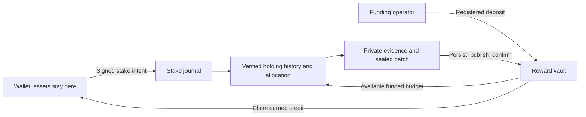

# Algorand Soft Staking

Generic infrastructure for ASA, NFT and LP-token staking on Algorand. Staked assets stay in users’ wallets. A funded reward vault reserves each published reward on-chain before a user can claim it.

The repository contains Algorand TypeScript contracts, a Supabase ledger and signed stake API, a Python reward scheduler, and wallet integration helpers. Bring your own assets, pool configuration, frontend and funding source.

## How it works

1. A wallet signs a short-lived stake or unstake authorisation. The API checks the wallet’s current signing authority and holdings, then records the action and its history atomically.
2. The funding operator deposits reward tokens with a grouped asset transfer and `fundBuyback` call. This recognises the deposit exactly once.
3. The scheduler opens a UTC monthly period using only recognised, unallocated funding. It reconstructs holdings and stake changes over each accounting window, including transfers between wallets.
4. It archives the evidence privately, seals the exact allocation batch, and records transaction identities before publishing.
5. The vault reserves cumulative credits for each wallet. A claim pays `allocated − paid` directly to that wallet.

Interrupted runs resume the stored batch. Already earned credits remain claimable after a stake is reduced or assets leave the wallet; those changes affect subsequent earning time.



## Funding rules

The vault enforces these invariants in reward-token base units:

```text
paid ≤ allocated ≤ deposited
vault balance ≥ allocated − paid
available = min(deposited − allocated, balance − (allocated − paid))
```

Unpaid credits are reserved; they cannot fund another month. A plain asset transfer does **not** count as a registered deposit. The contract has no reward withdrawal, credit deletion, application update or application deletion method.

A monthly budget is fixed when its period opens. Funding received during a funded period is available for the following period. A pool with no available funding waits; its first funded period can start mid-month, without backdating rewards. Time with no eligible stake creates no payable rewards.

For a pool card, **“paying now” is the full funded period total**, including rewards already issued or paid. It does not count down as users claim. “Next month” excludes both unpaid credits and the unfinished current-period budget. `sdk/display.ts` supplies this calculation and a non-compounding APR estimate based on the actual period length.

## Quick start

Prerequisites: Node.js 22 LTS or 24+, Python 3.11+, Deno 2.9.6, and [AlgoKit](https://dev.algorand.co/algokit/) 2.10.2+. Docker is needed for LocalNet integration tests.

```bash
npm ci
python3 -m venv .venv
source .venv/bin/activate
python -m pip install -r requirements.txt

npm run build
npm run check
npm test
npm run test:accounting
npm run check:edge
npm run test:edge

algokit localnet start
npm run test:contracts
npm run demo:localnet
```

`algokit project run build` and `algokit project run test` also compile and run the contract integration tests. The demo and contract tests use explicit loopback clients and reject MainNet and TestNet.

The demo creates an example ASA and funded vault and prints **public deployment configuration only**. It uses the LocalNet dispenser for all roles for convenience; a real deployment should use separate owner, publisher and funding accounts.

For a complete deployment, follow [Deployment and operations](docs/deployment.md). [Wallet integration](docs/wallet-integration.md) describes stake signatures, claim preparation and confirmation handling.

## Components

| Path | Purpose |
| --- | --- |
| `contracts/funded-rewards/` | Immutable reward vault, generated client and verified chain adapter |
| `contracts/legacy/` | Merkle contract reference for existing deployments and migration tests |
| `supabase/migrations/` | Fresh database schema, signed stake journal, funded ledger and private evidence bucket |
| `supabase/functions/` | Stake challenge, stake mutation, funded status/claim preparation, and privileged publication |
| `scripts/run_funded_rewards.py` | Preview-first reward scheduler with resumable publication |
| `scripts/verified_holdings.py` | Paginated holding history, inner transfers, closes and clawbacks |
| `sdk/` | Claim verification, wallet handoff, signed stake proof and display calculations |
| `scripts/tests/` | Accounting, database and wallet regression tests |
| `extras/algorand-matrix/` | Optional standalone blockchain visualiser |

There is no website application, hosted service, production pool registry or preconfigured treasury in this repository.

## Contract interface

| Method | Authority | Effect |
| --- | --- | --- |
| `create(...)` | Creator | Sets the reward ASA, pool identifier, publisher, funding operator and opening budget |
| `optInAsset()` | Owner | Opts the vault into its reward ASA |
| `fundBuyback(axfer)` | Funding operator | Registers an immediately preceding deposit; works with any funding source |
| `fundOpening(axfer)` | Owner | Imports an exact, one-time opening deposit before activation |
| `allocateRewards(user, previous, cumulative)` | Publisher or owner | Reserves a funded, monotonically increasing credit; exact retries are harmless |
| `activate()` | Owner | Opens claims after the opening allocation is complete |
| `claimRewards()` | Reward recipient | Pays the caller’s unpaid credit |
| `togglePause(state)` | Owner | Pauses allocation and claims without changing balances or credits |
| `updatePublisher(address)` | Owner | Rotates the publishing authority |
| `getSummary()`, `getReward(user)` | Read-only | Reports funding and cumulative credit state |
| `assertMigrationSource(app)` | Owner, read-only | Checks a compatible paused legacy source before an atomic migration |

Amounts use exact integers in token base units. Reward decimals are configurable, including zero. Each wallet’s reward box requires 22,100 microALGO of minimum balance, supplied to the vault by the operator. A claim uses a 2,000-microALGO application-call fee covering its inner transfer; an included ASA opt-in adds a 1,000-microALGO transaction and requires the wallet’s normal 0.1 ALGO minimum balance. There is no platform claim fee in this generic implementation.

## Trust and security

The contract enforces **solvency and cumulative payment accounting**. The off-chain operator remains trusted to select eligible recipients and calculate fair allocations; a malicious publisher could misallocate available funding, but cannot create credits beyond the contract’s recognised deposits. ASA freeze/clawback authorities remain a separate asset-level trust assumption.

Stake mutations require an exact, expiring, one-use wallet proof. Public clients cannot write stake or reward tables or call privileged ledger functions. Accounting stops when history, pagination, checkpoints, network identity, bytecode or confirmed balances cannot be verified.

Optional per-wallet reward caps have an effective timestamp and apply to verified earning weights. They preserve stored stakes and earned credits. A separate `max_stake` controls future additions. Pin the earning policy before registering the vault; policy changes require an explicit transition rather than silently rewriting an open period.

Evidence includes wallet histories and belongs in the private Storage bucket. Keep service credentials, publisher mnemonics, deployment files and evidence out of Git. Scheduled publication is disabled by default and requires explicit configuration in both the scheduler and the Edge Function. See [Security](SECURITY.md) for the boundaries and reporting guidance. This repository does not claim an independent security audit.

## License

[MIT](LICENSE). Built by [Polaris](https://dao.polaris.city) for the Algorand ecosystem.
